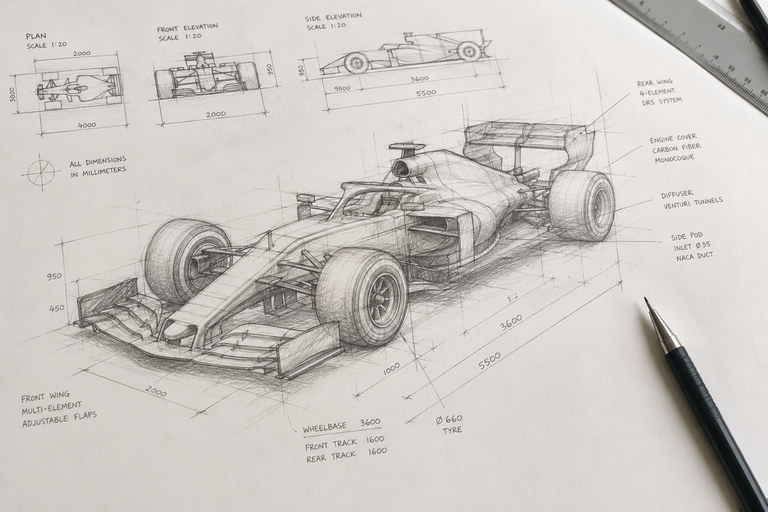

# Formula Telemetry Docs

Documentation site for [formula-telemetry.com](https://formula-telemetry.com) — explains the F1 data objects and concepts behind the app's telemetry visualizations.

Built with [Zensical](https://zensical.dev) (MkDocs-style static site generator).

## Live Site

[docs.formula-telemetry.com](https://docs.formula-telemetry.com)
