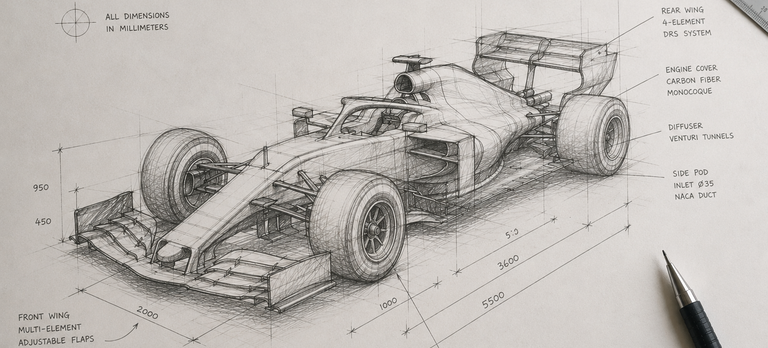
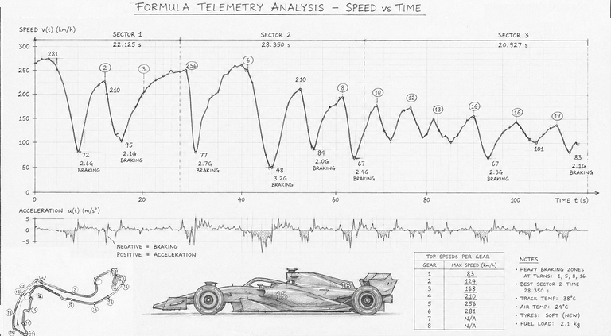

<style>
@keyframes walk {
  from { left: 100%; }
  to   { left: -160px; }
}
.walking-cat {
  position: fixed;
  top: 2px;
  left: 100%;
  width: 60px;
  animation: walk 14s linear infinite;
  pointer-events: none;
  z-index: 99999;
}
</style>


# Formula Telemetry Documentation



This documentation describes the Formula 1  telemetry data that is publicly available, and the principles behind how [formula-telemetry.com](https://formula-telemetry.com) is built on top of it.

Several key metrics unfortuneatly aren't public. The following metrics are missing from public data:

- **Tire temperatures and pressures**
- **Brake pressure** (we only get on/off, not how hard)
- **ERS deployment and battery state**
- **Fuel load**
- **Suspension travel and ride height**

These gaps shape what the app can, and cannot, show.




Every Formula 1 session produces a continuous stream of timing and telemetry data. The cars transmit it, the FIA collects it, and the broadcasters render parts of it on screen.

The raw feed comes from F1's livetiming feed, OpenF1 is a wrapper that turns it into a clean HTTP API, which this site uses to pull data into its own database.


---

## Data per one session?

It helps to see actual numbers. Here is a single Grand Prix — just the
**Race session**, not the whole weekend — broken down by object type:

| Object       | Records per race | What that is                                                          |
| ------------ | ---------------- | --------------------------------------------------------------------- |
| Session      | 1                | The race itself.                                                      |
| Drivers      | 20               | One entry per driver in the session.                                  |
| Laps         | ~1,380           | 20 drivers × ~69 laps. One row per completed lap.                     |
| CarData      | **~560,000**     | Telemetry samples at ~3.7 Hz per car, for the full race distance.     |
| Location     | **~540,000**     | `(x, y, z)` track positions, sampled at a similar rate to CarData.    |
| Position     | ~40,000          | Discrete position-change events (1st, 2nd, …, 20th).                  |
| Intervals    | ~20,000          | Per-driver gap-to-leader and gap-to-car-ahead updates.                |

That's well over **a million records for a single race session**, and
a race is only one of four to six sessions in a weekend. Stretch it
across an entire 24-round season and the numbers move into the tens
of millions:

```
2025 Season  ── 24 race weekends, ~156 sessions
├── Sessions   ──    ~156
├── Drivers    ──  ~3,120
├── Laps       ── ~125,430
├── CarData    ── ~13,504,176
├── Position   ──    ~890,123
└── Intervals  ──    ~445,678
```


The Formula Telemetry app ingests all of this into MongoDB, indexes
it by `session_key`, and serves it through its own API to the charts
you see. The dataset for a typical race weekend is well over a
gigabyte before it's been processed for display.

## Data structure

Every object on this site is scoped by two keys:

- `meeting_key` — identifies a whole race **weekend** (e.g. the
  Singapore Grand Prix 2024).
- `session_key` — identifies a single **session** within that weekend
  (FP1, FP2, FP3, Qualifying, Sprint Shootout, Sprint, Race).

```
Meeting Key: 1229 (Bahrain GP 2024)
├── Session Key: 9470  (Practice 1)
├── Session Key: 9471  (Qualifying)
└── Session Key: 9472  (Race)
        ├── Drivers, Laps, CarData, Location,
        │   Position, Intervals, Pit, Stints,
        │   Weather, RaceControl, TeamRadio,
        │   SessionResult, StartingGrid, Overtakes
```

If you only remember one thing about the structure: **everything
hangs off `session_key`**. That's the filter you'd use to ask "show
me Verstappen's telemetry from the 2024 Monaco race" — pick the
session, then pick the driver.
