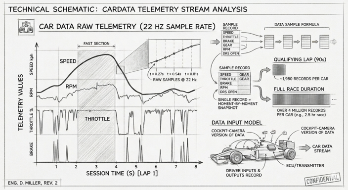

# Car Telemetry Data


`CarData` is the **raw telemetry stream** from each car. One record is
one snapshot of what the car was doing at one moment in time: how fast
it was going, how hard the driver was pressing the throttle, whether
the brake was on, which gear, what the engine was doing, and whether
DRS was open.

Records are produced at roughly **3.7 Hz** — about one
sample every 270 milliseconds — for the entire duration of a session,
for every driver.



## Fields

| Field            | Type    | Unit / Range   | Meaning |
| ---------------- | ------- | -------------- | ------- |
| `date`           | string  | ISO 8601 UTC   | Timestamp of this sample. |
| `session_key`    | int     | —              | The session this record belongs to. |
| `meeting_key`    | int     | —              | The race weekend (`Meeting`) this session belongs to. |
| `driver_number`  | int     | 1–99           | Permanent race number of the driver (e.g. 1 = Verstappen, 44 = Hamilton). |
| `speed`          | int     | km/h           | GPS-derived ground speed. |
| `throttle`       | int     | 0–100          | Accelerator pedal position. 0 = fully off, 100 = flat out. |
| `brake`          | int     | 0 or 100       | Brake pedal status. Binary — F1 cars do not expose brake pressure publicly. |
| `n_gear`         | int     | 0–8            | Current gear. 0 = neutral, 1–8 = gear number. |
| `rpm`            | int     | 0–~15 000      | Engine revolutions per minute. |
| `drs`            | int     | code           | DRS status code. See table below. |


## Sample record

```json
{
  "date": "2023-03-05T15:00:34.123000+00:00",
  "session_key": 7953,
  "meeting_key": 1141,
  "driver_number": 1,
  "speed": 312,
  "throttle": 100,
  "brake": 0,
  "n_gear": 7,
  "rpm": 11623,
  "drs": 12
}
```

