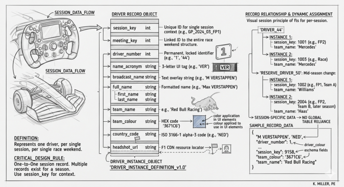

# Drivers




A `Driver` record describes one driver entered in one session. There
is one record per driver per session — meaning a driver who races
the full season will have a separate record for every FP1, FP2, FP3,
Qualifying, Sprint, and Race they take part in.

Driver records carry the basics needed to render a driver in the UI:
the racing number, the three-letter acronym, the team and team colour,
and a portrait URL.

## Fields

| Field            | Type   | Meaning |
| ---------------- | ------ | ------- |
| `session_key`    | int    | The session this record belongs to. |
| `meeting_key`    | int    | The race weekend this session belongs to. |
| `driver_number`  | int    | Permanent racing number, e.g. `1` (Verstappen), `44` (Hamilton), `16` (Leclerc). |
| `name_acronym`   | string | Three-letter code used on timing screens, e.g. `"VER"`, `"HAM"`, `"LEC"`. |
| `broadcast_name` | string | Name as shown on TV, e.g. `"M VERSTAPPEN"`. |
| `first_name`     | string | First name. |
| `last_name`      | string | Surname. |
| `full_name`      | string | Full formatted name, e.g. `"Max VERSTAPPEN"`. |
| `team_name`      | string | Constructor name, e.g. `"Red Bull Racing"`. |
| `team_colour`    | string | Team hex colour without the `#`, e.g. `"3671C6"`. Used everywhere a driver line or dot is drawn. |
| `country_code`   | string | ISO 3166-1 alpha-3 code for the driver's nationality, e.g. `"NED"`, `"GBR"`. |
| `headshot_url`   | string | URL to driver portrait image, hosted on the F1 CDN. |

## Sample record

```json
{
  "broadcast_name": "M VERSTAPPEN",
  "country_code": "NED",
  "driver_number": 1,
  "first_name": "Max",
  "full_name": "Max VERSTAPPEN",
  "headshot_url": "https://www.formula1.com/content/dam/fom-website/drivers/M/MAXVER01_Max_Verstappen/maxver01.png.transform/1col/image.png",
  "last_name": "Verstappen",
  "meeting_key": 1219,
  "name_acronym": "VER",
  "session_key": 9158,
  "team_colour": "3671C6",
  "team_name": "Red Bull Racing"
}
```

## Per-session, not per-season

A driver who changes teams mid-season — or a reserve who fills in for
one weekend — will have records with different `team_name` and
`team_colour` values across sessions. Always use the `Driver` record
for the specific `session_key` you're looking at, not a global driver
table.
