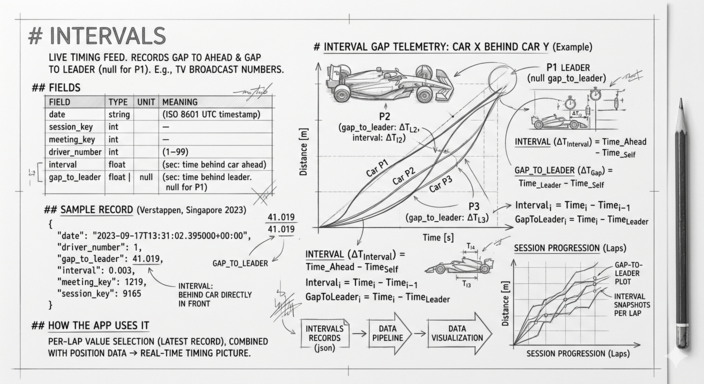

# Intervals



`Intervals` is the live timing feed: every few seconds during a race,
one record is emitted per driver showing how far they are behind the
car directly ahead and how far they are behind the race leader. It is
the data behind every "gap to leader" and "interval" number you see
on a TV broadcast.

There is no `Intervals` record for the race leader's gap to anyone
ahead — there is no one ahead, so `gap_to_leader` is `null` for P1.

## Fields

| Field            | Type           | Unit    | Meaning |
| ---------------- | -------------- | ------- | ------- |
| `date`           | string         | ISO 8601 UTC | Timestamp of this update. |
| `session_key`    | int            | —       | The session this record belongs to. |
| `meeting_key`    | int            | —       | The race weekend. |
| `driver_number`  | int            | 1–99    | Driver this gap applies to. |
| `interval`       | float          | seconds | Time behind the car directly ahead. |
| `gap_to_leader`  | float \| null  | seconds | Time behind the race leader. `null` for P1. |

## Sample record

```json
{
  "date": "2023-09-17T13:31:02.395000+00:00",
  "driver_number": 1,
  "gap_to_leader": 41.019,
  "interval": 0.003,
  "meeting_key": 1219,
  "session_key": 9165
}
```

That record is Verstappen at the Singapore 2023 race: 41.019 seconds
behind the leader, 0.003 seconds behind the car directly in front of
him.
