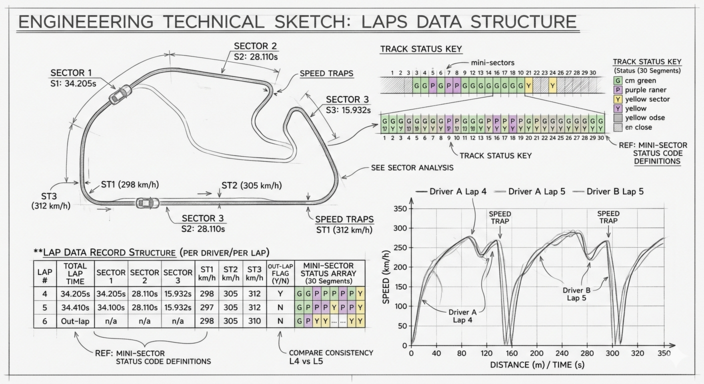

# Laps



`Laps` in the database is the **lap-by-lap summary** of a session. Where [CarTelemetry](car-telemetry.md)
gives you a sample every ~270 ms, `Laps` gives you exactly one record
per completed lap, per driver.

### How much data is that?

A typical Grand Prix runs **50–70 laps**, so a race session yields roughly
**1 000–1 400 lap records** (22 drivers × lap count), minus any DNFs. A
60-minute practice or qualifying session produces around **20–35 laps per
driver** depending on track length and run plan, for **400–700 records**
total. A Sprint race is shorter — typically **20–30 laps**, around **400–600
records**. Over a full season (~24 weekends, 5 sessions each), the `Laps`
collection holds in the order of **150 000 records**, which is small enough
to query freely without pagination — unlike [CarTelemetry](car-telemetry.md), where a
single race can exceed 10 million samples.

A completed lap is on the order of **70–110 seconds** depending on the
circuit (Monaco ~73 s, Spa ~106 s, Las Vegas ~95 s). Sector times typically
split the lap into three roughly equal thirds, but track layout can skew
this — at some circuits one sector is meaningfully longer than the others.


### Identifiers

| Field            | Type    | Meaning |
| ---------------- | ------- | ------- |
| `session_key`    | int     | The session this lap belongs to. |
| `meeting_key`    | int     | The race weekend this session belongs to. |
| `driver_number`  | int     | Driver who completed this lap. |
| `lap_number`     | int     | Lap number within the session (1, 2, 3, …). |
| `date_start`     | string  | UTC timestamp when this lap started. |

### Timing

| Field                 | Type   | Unit    | Meaning |
| --------------------- | ------ | ------- | ------- |
| `lap_duration`        | float  | seconds | Total time for this lap. `null` if the lap was not completed. |
| `duration_sector_1`   | float  | seconds | Sector 1 time. Sums (roughly) with sectors 2 and 3 to `lap_duration`. |
| `duration_sector_2`   | float  | seconds | Sector 2 time. |
| `duration_sector_3`   | float  | seconds | Sector 3 time. |


## Sample record

```json
{
  "session_key": 7953,
  "meeting_key": 1141,
  "driver_number": 1,
  "lap_number": 17,
  "date_start": "2023-03-05T15:18:42.310000+00:00",
  "lap_duration": 95.122,
  "duration_sector_1": 30.451,
  "duration_sector_2": 38.207,
  "duration_sector_3": 26.464,
  "i1_speed": 312,
  "i2_speed": 268,
  "st_speed": 327,
  "is_pit_out_lap": false,
  "segments_sector_1": [2049, 2049, 2051, 2049, 2048, ...],
  "segments_sector_2": [...],
  "segments_sector_3": [...]
}
```
