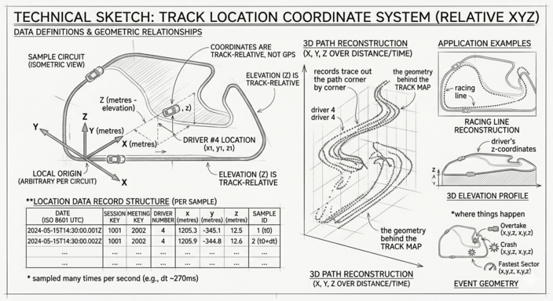

# Location





Each record is a single `(x, y, z)` coordinate for one driver at one moment in time. Sampled
many times per second for the entire session, the records together
trace out the path the car drove — corner by corner, lap by lap.

It's the geometry behind the Track Map:
the driver dots, the racing line drawn on the circuit, and the 3D
elevation views all come from `Location`.

The coordinates are **track-relative**, not GPS — meaning the origin
and axis directions are arbitrary and differ per circuit. See the
"Coordinate system" section below for why this matters.

## Fields

| Field           | Type    | Unit / Range  | Meaning |
| --------------- | ------- | ------------- | ------- |
| `date`          | string  | ISO 8601 UTC  | Timestamp of this sample. |
| `session_key`   | int     | —             | The session this record belongs to. |
| `meeting_key`   | int     | —             | The race weekend (`Meeting`) this session belongs to. |
| `driver_number` | int     | 1–99          | Permanent race number of the driver. |
| `x`             | float   | metres        | Track-relative X coordinate. |
| `y`             | float   | metres        | Track-relative Y coordinate. |
| `z`             | float   | metres        | Track-relative elevation. |

## Sample record

```json
{
  "date": "2023-03-05T15:00:34.123000+00:00",
  "session_key": 7953,
  "meeting_key": 1141,
  "driver_number": 1,
  "x": 1542.7,
  "y": -823.4,
  "z": 12.1
}
```

## Coordinate system

The coordinates are **track-relative, not GPS**:

- The origin `(0, 0, 0)` and axis orientation are arbitrary and differ
  per circuit. Don't try to interpret X as east or Y as north — they
  vary by track.
- Distances are metric and consistent *within* a session. The distance
  between two samples in metres is a meaningful real-world distance.
- You cannot directly overlay coordinates from two different
  circuits, even if the units are the same. The frames of reference
  don't match.
- `z` is elevation in metres relative to the same arbitrary origin.
  At a flat circuit (Bahrain) `z` barely changes; at Spa it varies by
  tens of metres across a lap.

