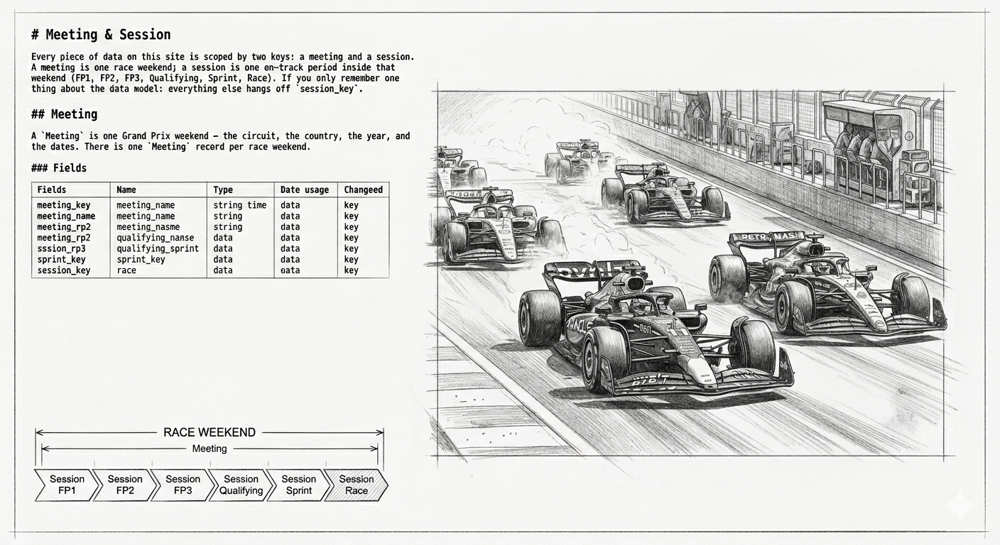

# Meeting & Session




Every piece of data on this site is scoped by two keys: a **meeting**
and a **session**. A meeting is one race weekend; a session is one
on-track period inside that weekend (FP1, FP2, FP3, Qualifying,
Sprint, Race). If you only remember one thing about the data model:
**everything else hangs off `session_key`**.

## Meeting

A `Meeting` is one Grand Prix weekend — the circuit, the country, the
year, and the dates. There is one `Meeting` record per race weekend.

### Fields

| Field                   | Type   | Meaning |
| ----------------------- | ------ | ------- |
| `meeting_key`           | int    | Unique identifier for this weekend. Foreign key for every other object. |
| `meeting_name`          | string | Short Grand Prix name, e.g. `"Singapore Grand Prix"`. |
| `meeting_official_name` | string | Full sponsor name, e.g. `"FORMULA 1 SINGAPORE AIRLINES SINGAPORE GRAND PRIX 2023"`. |
| `circuit_key`           | int    | Unique circuit identifier. |
| `circuit_short_name`    | string | Short circuit name, e.g. `"Singapore"`, `"Monaco"`. |
| `location`              | string | City or region, e.g. `"Marina Bay"`. |
| `country_name`          | string | Full country name. |
| `country_code`          | string | ISO 3166-1 alpha-3 code, e.g. `"SGP"`, `"GBR"`. |
| `country_key`           | int    | Country identifier. |
| `date_start`            | string | Weekend start, ISO 8601 UTC. |
| `gmt_offset`            | string | Local timezone offset, e.g. `"08:00:00"`. |
| `year`                  | int    | Season year. |

### Sample record

```json
{
  "circuit_key": 61,
  "circuit_short_name": "Singapore",
  "country_code": "SGP",
  "country_key": 157,
  "country_name": "Singapore",
  "date_start": "2023-09-15T09:30:00+00:00",
  "gmt_offset": "08:00:00",
  "location": "Marina Bay",
  "meeting_key": 1219,
  "meeting_name": "Singapore Grand Prix",
  "meeting_official_name": "FORMULA 1 SINGAPORE AIRLINES SINGAPORE GRAND PRIX 2023",
  "year": 2023
}
```

## Session

A `Session` is one on-track period within a meeting. A typical race
weekend has 4–6 sessions: three practice sessions, qualifying, the
race, and on Sprint weekends an extra Sprint Shootout and Sprint
race.

### Fields

| Field                | Type   | Meaning |
| -------------------- | ------ | ------- |
| `session_key`        | int    | Unique identifier for this session. The primary filter for every telemetry object. |
| `meeting_key`        | int    | The weekend this session belongs to. |
| `session_name`       | string | Display name, e.g. `"Practice 1"`, `"Qualifying"`, `"Race"`. |
| `session_type`       | string | Generic type, e.g. `"Practice"`, `"Qualifying"`, `"Race"`, `"Sprint"`. |
| `date_start`         | string | Session start, ISO 8601 UTC. |
| `date_end`           | string | Session end, ISO 8601 UTC. |
| `circuit_key`        | int    | Circuit identifier (duplicated from `Meeting` for convenience). |
| `circuit_short_name` | string | Short circuit name (duplicated). |
| `country_name`       | string | Country name (duplicated). |
| `country_code`       | string | ISO country code (duplicated). |
| `country_key`        | int    | Country identifier (duplicated). |
| `location`           | string | City or region (duplicated). |
| `gmt_offset`         | string | Local timezone offset (duplicated). |
| `year`               | int    | Season year (duplicated). |

### Session types

| `session_type` value | Typical `session_name` values             | Duration       |
| -------------------- | ----------------------------------------- | -------------- |
| `Practice`           | `Practice 1`, `Practice 2`, `Practice 3`  | ~60 minutes    |
| `Qualifying`         | `Qualifying`                              | ~60 minutes    |
| `Sprint Qualifying`  | `Sprint Shootout`                         | ~12 min/segment|
| `Sprint`             | `Sprint`                                  | ~30 minutes    |
| `Race`               | `Race`                                    | ~2 hours       |

Note that `session_type` returns the generic family name (e.g. all
three practice sessions are `"Practice"`). Use `session_name` when
you need the specific session within that family.

### Sample record

```json
{
  "circuit_key": 61,
  "circuit_short_name": "Singapore",
  "country_code": "SGP",
  "country_key": 157,
  "country_name": "Singapore",
  "date_end": "2023-09-17T14:00:00+00:00",
  "date_start": "2023-09-17T12:00:00+00:00",
  "gmt_offset": "08:00:00",
  "location": "Marina Bay",
  "meeting_key": 1219,
  "session_key": 9165,
  "session_name": "Race",
  "session_type": "Race",
  "year": 2023
}
```
