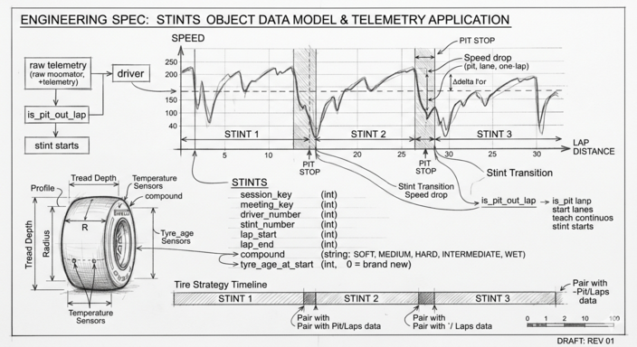

# Stints



A **stint** is a continuous run by one driver on one set of tires. One
`Stints` record covers one stint: the driver, the compound, which laps
it ran from and to, and how worn the tires were when the stint began.

In a race, the first stint of each driver starts at lap 1. Every pit
stop ends one stint and begins the next: a driver who pits three times
has four stints. In practice and qualifying, drivers may complete many
short stints over the course of the session.

`Stints` is what makes the Tire Strategy
timeline possible — each coloured segment in a driver's lane on that
chart is one `Stints` record, drawn from `lap_start` to `lap_end` and
coloured by `compound`.

## Fields

| Field                | Type    | Meaning |
| -------------------- | ------- | ------- |
| `session_key`        | int     | The session this stint belongs to. |
| `meeting_key`        | int     | The race weekend. |
| `driver_number`      | int     | Driver this stint belongs to. |
| `stint_number`       | int     | Stint index for this driver in this session (1, 2, 3, …). |
| `lap_start`          | int     | First lap of the stint. |
| `lap_end`            | int     | Last lap of the stint. |
| `compound`           | string  | Tire compound for this stint. One of `SOFT`, `MEDIUM`, `HARD`, `INTERMEDIATE`, `WET`. |
| `tyre_age_at_start`  | int     | Number of laps the tires had already been used before this stint started. `0` = brand new. |

## Sample record

```json
{
  "session_key": 7953,
  "meeting_key": 1141,
  "driver_number": 1,
  "stint_number": 2,
  "lap_start": 18,
  "lap_end": 35,
  "compound": "HARD",
  "tyre_age_at_start": 0
}
```

This is Verstappen's second stint at the 2023 Bahrain Grand Prix: a
brand-new set of hards, run from lap 18 to lap 35 (18 laps long).

